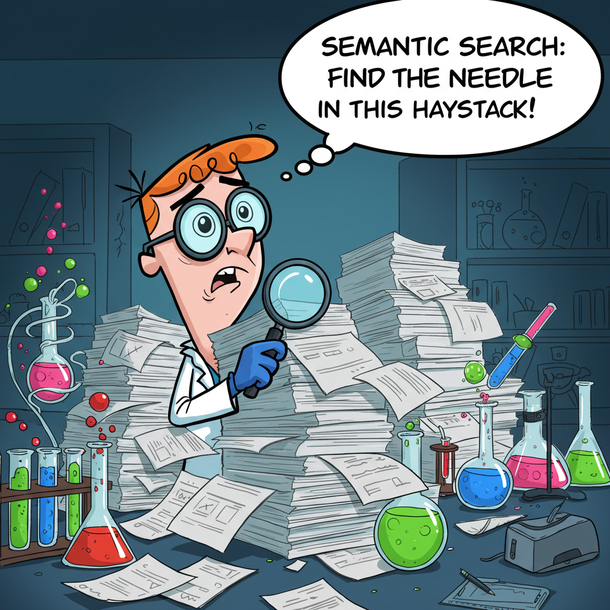
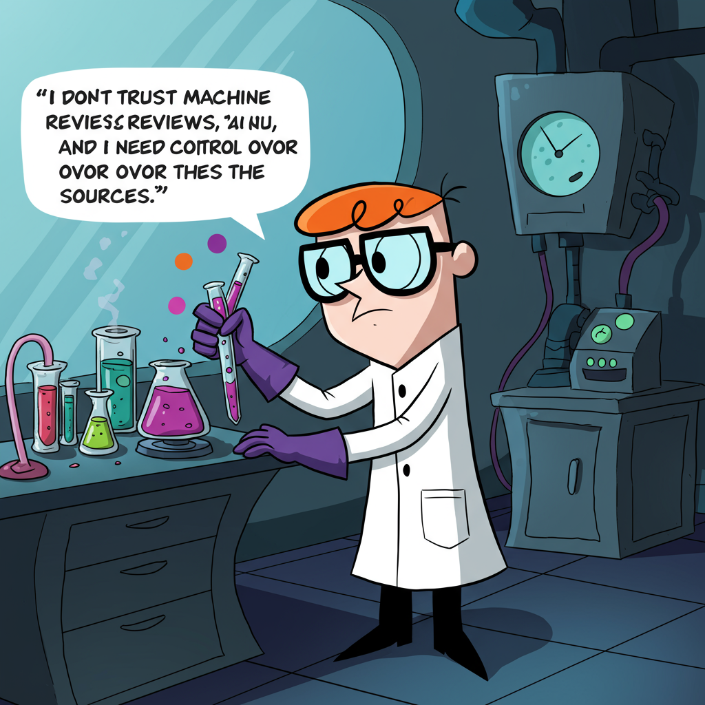

DEMO scenario
-------------

# Slides with intro

The life is getting faster and faster every day. As well as scientific research. This allows us to move forward and opens an unlimited possibilities in discovery the hidden parts and unanswered questions of universe.
And the scientist, as a pioneers of the knowledge frontier are having the tough time trying to cope with all the latest publications burden with millions of them published yearly!

* You have to learn. 
* You have to move forward. 
* You have to be always one step ahead. 

* But how? Can any technology help with this? 

With our project, we aim to help people in digesting this information load in a concise, comprehensive and actionable way. We introduce the latest Google AI models powered PubTrends project. Your scientific literature explorer, which highlights the most important findings, structurizes the data and significantly reduce the time from bold ideas to verifications and experiment.

# Slide with two points and image.

Don't know the exact search keywords? There are different keywords for the same thing and I want to use Semantic Search for finding relevant papers.

I am knowledgeable in my native language terminology and I don't want to miss any details so I use search on my local language with the help of AI.

# Slide with two points and image.

When searching for papers and I go to Google Scholar I get million papers in one millisecond and I don't know where to start. I want to get a concise representation of the field with one click.

I am interested of what is exactly known about X in different contexts, and I don't have time / capabilities to go through all 100 papers, so that I want to use categorized summary to save time.

# Slide with one point and image. 

And the last but not least, I don't trust machine only review and I need control over the sources and story telling to get scientific trustably result, I want PubTrends review buddy to show me all the available options.

Here some additional illustrations are required. Text only now.

Our hackathon project brings the power of cutting edge AI models developed by Google into the are of scientific publication analysis. Existing intellectual simultaneous graph and text embeddings analysis allows PubTrends engine to robustly extract highly relevant topics from the scientific corpus. But now you can do much more!

# Slide with main features:

* Search improvement
* Categorized search

Speech in the background: 

Search not only by keywords, facing the problems of synonyms, typos or different naming of the same things, but by the genuine requests in your native language!

Use the citations information and texts of titles and abstract to robustly decompose tons of papers into human-digestible and actionable things, providing not only textual information but by providing the end-user with a different aspects of the knowledge hidden in them. Explore most important Genes, Drugs and chemicals, Deceases and medical conditions in a simple and truthworthy representation, baked 100% evidence based approach.

# Slide But the talk is cheap, it is time to demonstrate the working MVP!

Think about visually appealing presentation, or show demo in the same time?

Our MVP combines a Semantic Search provided by Google BigQuery, intellectual analytics from PubTrends and entity recognition and summarization capabilities provided by the cutting edge Gemini models. Powered by Junie it was a real fun implementing this!

At first, we used PubTrends as a publication database provider to get the major textual information about the papers, namely titles and abstracts. Next, we uploaded the export results split by publication years into the Google BigQuery data warehouse. Embeddings computed with the help of Text Multilingual Embeddings model (text-multilingual-embedding-002) for adding embedding to the database and then we used Google Cloud Run technology to build an endpoint for efficient vectorized embedding search in any language!

Next, we focused on the evidence based categorized summarization. Given the papers connectivity graph we were able to extract only the most important papers from the output (we didn't used most cited approach, since it is significantly biased towards the older papers). We experimented with Gemini 2.0 flash and flash lite models to get the best fit for our specific tasks and went with gemini-2.0-flash-001. We used the model to extract the genes, drugs etc from the papers only without any external resources, to ensure the validity of the results. We extracted the entities together with their context from the papers and sorted them by the frequency making the most trustworthy be on the top of the output. Compared to the default text-based reviews this approach highlights the most biologically relevant information. 

Additionally we used conventional text-only summaries. For topics summary from abstract we utilised gemini-2.5-flash-preview-04-17 (with thinking_budget=1000).

# Slide Validations of MVP

* Multilingual query example
* Categorial summary validation
* Text only summary validation

Applications of Large Language Models are highly temping but they are usually prone to hallucination so it was crucial to validate the results.
Firstly, we validated the semantic search approach by generating titles from abstracts summaries in different languages including English, German, Polish and Russian. We used gemini-2.0-flash-lite-001 for this task.

Next, we focused on relevance check of extracted categories. We downloaded the handful of most cited review papers from Nature journal, and for each review paper we used the title to load papers for the preceding 5 years before the publication date in PubTrends. Next we compared the overlap between genes extracted using similar prompts from downloaded full text PDF and a set of papers. Notable, the overlap was reasonable high in most of the cases, yielding low values only when full text PDF didn't contain much information on genes.

Finally, we tried to evaluate the quality of the automatic generated summaries versus the topics in review paper full texts. We utilised text embedding models namely text-embedding-005, and compared cosine distance between text summaries, but this approach worked poorly, highlighting the limitation of text-only summaries for scientific purposes.

# Slide technical

Technically speaking, the solution contains of the following parts:
* Introduced year ranges to existing PubTrends codebase
* API in PubTrends for communicating with MVP
* BigQuery setup and Google Cloud Run endpoint for sematic search
* Google Cloud Run endpoint for categorised summarisation
* Flask based MVP combining all the above in one web application

# Showcases

* Showcase of the Semantic search in native language
* Showcase of Categorised summary
