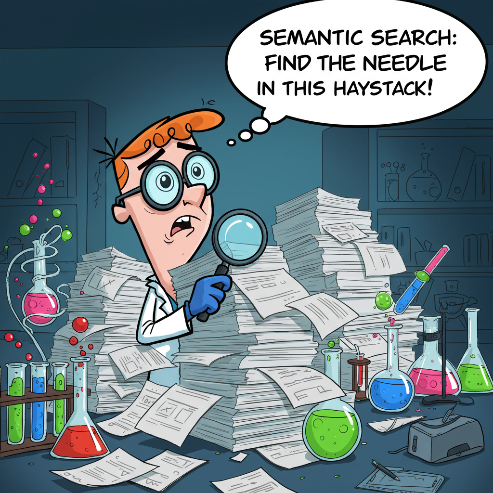
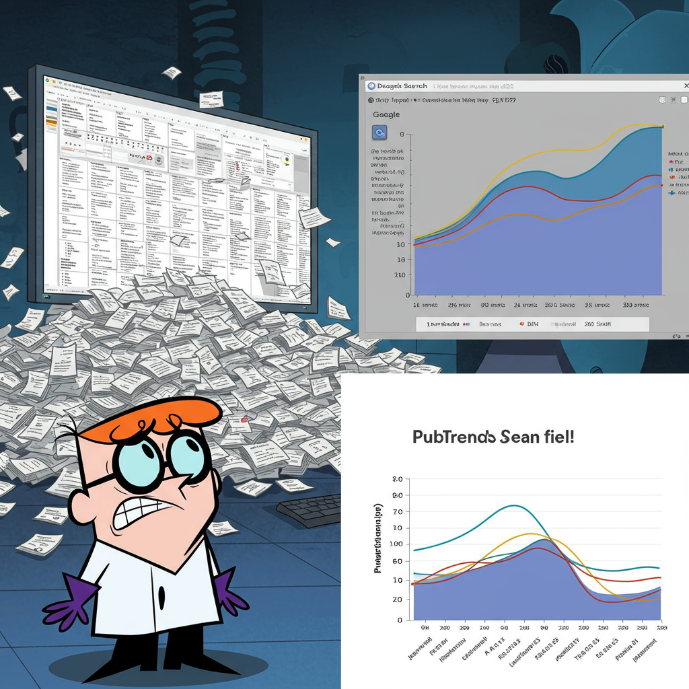
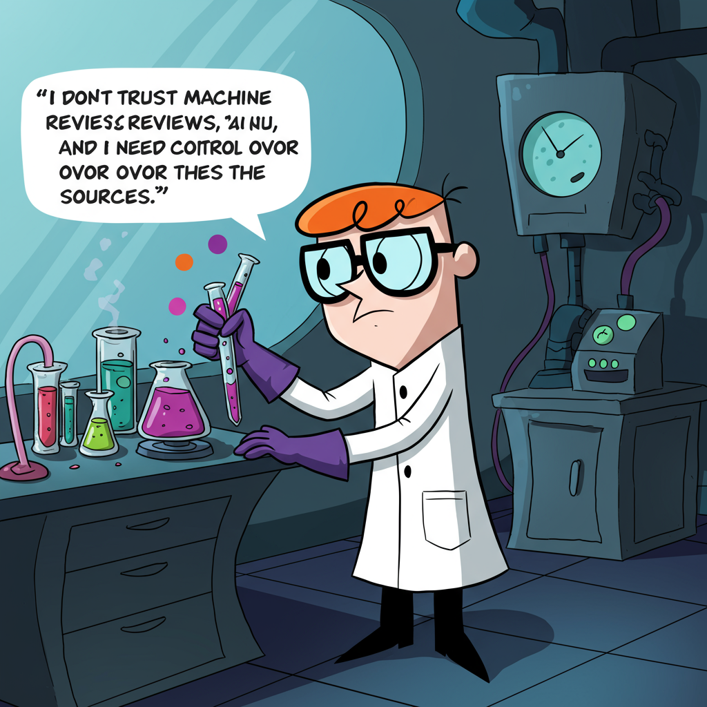

Hackathon project AIHKTN25-28
-----------------------------

A Flask application with a search query field and a toggle switch to choose between "New shiny semantic search" and "Good old text search".

It integrates
* Google BigQuery API for sematic search
* Google LLM models API for categorized structured summary
* PubTrends API for publications graph analysis and clustering


Jobs To Be Done
---------------

* I don't know exact keywords. There are different keywords for the same thing and I want to use Pubtrends Semantic Search for finding relevant papers.

Prompt to generate image:
```
A highly cluttered laboratory scene. A scientist, wearing oversized glasses perched precariously on their nose and a slightly askew lab coat, is buried under an avalanche of research papers. The papers are stacked so high they resemble a small mountain range. The scientist is cross-eyed, holding a magnifying glass up to a single paper, a look of utter bewilderment on their face. Use the Dexter lab cartoon like style for the image. Hovering above their head is a thought bubble with the words "Semantic Search: Find the NEEDLE in this haystack!" The overall style is cartoonish and humorous, emphasizing the scientist's overwhelmed state. Include beakers bubbling with brightly colored, improbable liquids in the background for added chaos. Make it clear this situation is absurdly overwhelming, but ultimately funny.
```




* I am knowledgeable in my native language terminology and I don't want to miss any details so I use search on my local language with Pubtrends Semantic Search.

* When searching for papers and I go to Google Scholar I get million papers in one millisecond and I don't know where to start. I want to get a concise representation of the field with Pubtrends.

Prompt to generate image:
```
Generate an image in the style of the Dexter's Laboratory cartoon series. The image should depict a scene where a researcher is overwhelmed by the vast number of papers appearing on Google Scholar after a search. The researcher should be standing in front of a giant computer screen displaying an endless stream of research papers, with exaggerated expressions of confusion and frustration.
In contrast, on the other side of the image, show a clear and concise representation of the same research field using Pubtrends. This representation should be visually appealing and easy to understand, highlighting the key topics within the field. Use only a single plot. Don't add much text.
```



* I am interested of what is exactly known about X in different contexts, and I don't have time / capabilities to go through all 100 papers, so that I want to use categorized summary to save time.

* In biology everything is connected and papers lie, I want to get a confidence of interconnections so that I want to use Pubtrends to build reliable relations.

* I don't trust machine only review and I need control over the sources and story telling to get scientific trustably result, I want PubTrends review buddy to show me all the available options.

Prompt to generate image:
```
Create an image with the following characteristics:
Subject: A scientist in a laboratory setting looking like Dexter from cartoon series.
Style: The image should be in the style of the "Dexter's Laboratory" cartoon.
Main Idea: "I don't trust machine-only reviews, and I need control over the sources."
Additional Details: Ensure the image captures the essence of a scientific environment while maintaining the cartoonish style of "Dexter's Laboratory." The scientist should be engaged in some form of research or experimentation, and the overall composition should reflect the idea of needing control over sources and storytelling for trustworthy results. Please use only limited number of text.
```



Jumbotron
---------
Prompt:
```
This should be a jumbotron image. 
Style: The image should be in the style of the "Dexter's Laboratory" cartoon. 
Additional: It should use pale colors. There should be only one human on the image.
Main Ideas: "1. Fast concise representation of the scientific area. 2.  Control over the sources and facts."
It should show the complex pipeline of API calls to Google cloud.
```